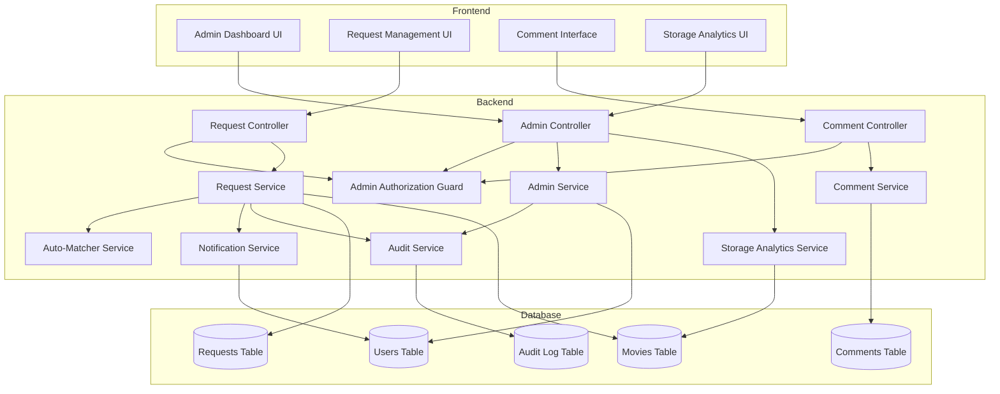

# Design Document: Admin Request Fulfillment System

## Overview

The admin request fulfillment system extends the existing movie application with comprehensive administrative capabilities for managing user movie requests. The system implements role-based access control, automated request-to-upload matching, status workflow management, collaborative commenting, and storage analytics.

The design leverages the existing NestJS backend architecture, PostgreSQL database with Kysely query builder, and React + Mantine frontend. The system integrates seamlessly with the current movie upload workflow and request infrastructure while adding new administrative capabilities.

### Core Design Principles

1. **Separation of Concerns**: Admin logic is isolated in dedicated modules, services, and guards
2. **Authorization First**: All admin operations are protected by role-based guards
3. **Audit Everything**: All administrative actions are logged for accountability
4. **Automation Where Possible**: Automatic request matching reduces manual work
5. **Progressive Enhancement**: Features build incrementally without breaking existing functionality

## Architecture

### System Components



### Data Flow

**Request Status Update Flow:**
1. Admin initiates status update via UI
2. Request reaches AdminController with admin credentials
3. AuthGuard validates admin role
4. AdminService updates request status
5. AuditService logs the action
6. NotificationService sends notification to request owner
7. Response returns to UI with updated request

**Auto-Matching Flow:**
1. Movie upload completes
2. Upload service triggers MatcherService
3. MatcherService searches for matching requests (OMDb ID or fuzzy title)
4. For each match, RequestService updates status to completed
5. AuditService logs auto-completion
6. NotificationService sends notifications to request owners

## Components and Interfaces

### Database Schema Extensions

#### Users Table Extension
```typescript
interface User {
  id: number;
  username: string;
  pin_hash: string;
  role: 'user' | 'admin';  // NEW FIELD
  created_at: Date;
  updated_at: Date;
}
```

#### Requests Table Extension
```typescript
interface Request {
  id: number;
  user_id: number;
  title: string;
  priority: 'low' | 'medium' | 'high' | 'urgent';
  status: 'queued' | 'processing' | 'completed';
  notes: string | null;
  omdb_id: string | null;
  fulfilled_by: number | null;        // NEW FIELD - admin user ID or null
  fulfilled_at: Date | null;          // NEW FIELD
  fulfilled_by_movie_id: number | null; // NEW FIELD - movie that fulfilled request
  created_at: Date;
  updated_at: Date;
}
```

#### Comments Table (New)
```typescript
interface Comment {
  id: number;
  request_id: number;
  user_id: number;
  comment_text: string;
  created_at: Date;
  updated_at: Date;
}
```

#### Audit Log Table (New)
```typescript
interface AuditLog {
  id: number;
  admin_id: number | null;  // null for system actions
  request_id: number;
  action_type: 'status_update' | 'priority_update' | 'delete' | 'bulk_operation';
  old_value: string | null;
  new_value: string | null;
  metadata: Record<string, any> | null;  // JSON field for additional context
  created_at: Date;
}
```

### Backend Services

#### AdminAuthGuard
```typescript
@Injectable()
class AdminAuthGuard implements CanActivate {
  canActivate(context: ExecutionContext): boolean {
    // Extract user from request context
    // Check if user.role === 'admin'
    // Return true if admin, false otherwise
    // Throw UnauthorizedException if not admin
  }
}
```

#### RequestService Extensions
```typescript
@Injectable()
class RequestService {
  // Existing methods...
  
  async updateStatus(
    requestId: number,
    newStatus: RequestStatus,
    adminId: number
  ): Promise<Request> {
    // Validate request exists
    // Get old status
    // Update status in database
    // If status is 'completed', set fulfilled_by and fulfilled_at
    // Log audit entry
    // Send notification
    // Return updated request
  }
  
  async updatePriority(
    requestId: number,
    newPriority: Priority,
    adminId: number
  ): Promise<Request> {
    // Similar to updateStatus
  }
  
  async bulkUpdateStatus(
    requestIds: number[],
    newStatus: RequestStatus,
    adminId: number
  ): Promise<BulkOperationResult> {
    // Validate requestIds length <= 100
    // For each request, call updateStatus
    // Collect successes and failures
    // Return summary
  }
  
  async bulkDelete(
    requestIds: number[],
    adminId: number
  ): Promise<BulkOperationResult> {
    // Validate requestIds length <= 100
    // For each request, delete and log audit
    // Collect successes and failures
    // Return summary
  }
  
  async searchRequests(
    searchTerm: string,
    searchType: 'title' | 'username' | 'omdb_id'
  ): Promise<Request[]> {
    // Build query based on searchType
    // Execute case-insensitive search
    // Limit to 100 results
    // Return matching requests
  }
  
  async getRequestsWithFilters(
    filters: RequestFilters,
    pagination: PaginationOptions
  ): Promise<PaginatedResult<Request>> {
    // Build query with filters (status, priority, user_id)
    // Apply sorting
    // Apply pagination
    // Return paginated results
  }
}
```

#### AutoMatcherService (New)
```typescript
@Injectable()
class AutoMatcherService {
  constructor(
    private requestService: RequestService,
    private notificationService: NotificationService,
    private auditService: AuditService
  ) {}
  
  async matchUploadToRequests(movie: Movie): Promise<MatchResult> {
    // If movie has omdb_id, search for exact matches
    // Otherwise, perform fuzzy title matching (>= 85% similarity)
    // For each matching request with status 'queued' or 'processing':
    //   - Update status to 'completed'
    //   - Set fulfilled_by to null (system)
    //   - Set fulfilled_at to current timestamp
    //   - Set fulfilled_by_movie_id to movie.id
    //   - Log audit entry with action_type 'auto_match'
    //   - Send notification to request owner
    // Return list of matched request IDs
  }
  
  private calculateTitleSimilarity(title1: string, title2: string): number {
    // Implement Levenshtein distance or similar algorithm
    // Normalize titles (lowercase, trim, remove special chars)
    // Return similarity percentage (0-100)
  }
}
```

#### CommentService (New)
```typescript
@Injectable()
class CommentService {
  async createComment(
    requestId: number,
    userId: number,
    commentText: string
  ): Promise<Comment> {
    // Validate comment text (not empty, <= 2000 chars)
    // Validate request exists
    // Insert comment into database
    // Return created comment
  }
  
  async getCommentsForRequest(requestId: number): Promise<Comment[]> {
    // Query comments for request
    // Order by created_at ASC
    // Join with users table to get usernames
    // Return comments with user info
  }
  
  async deleteComment(
    commentId: number,
    userId: number,
    isAdmin: boolean
  ): Promise<void> {
    // Get comment
    // If not admin and comment.user_id !== userId, throw UnauthorizedException
    // Delete comment
  }
}
```

#### StorageAnalyticsService (New)
```typescript
@Injectable()
class StorageAnalyticsService {
  async getStorageMetrics(): Promise<StorageMetrics> {
    // Query all movies with file sizes
    // Calculate total storage used
    // Calculate average file size
    // Identify top 10 largest files
    // Get available disk space from system
    // Calculate usage percentage
    // Return metrics object
  }
  
  async getMovieStorageDetails(): Promise<MovieStorageDetail[]> {
    // Query all movies with file sizes
    // Sort by size descending
    // Return list with movie title, size, and path
  }
  
  private formatBytes(bytes: number): string {
    // Convert bytes to human-readable format (GB, MB, KB)
  }
}
```

#### AuditService (New)
```typescript
@Injectable()
class AuditService {
  async logAction(entry: AuditLogEntry): Promise<void> {
    // Insert audit log entry into database
    // Include timestamp
  }
  
  async getAuditTrailForRequest(requestId: number): Promise<AuditLog[]> {
    // Query audit logs for request
    // Order by created_at DESC
    // Join with users table to get admin usernames
    // Return audit entries
  }
  
  async getAuditTrailForAdmin(adminId: number): Promise<AuditLog[]> {
    // Query audit logs by admin
    // Order by created_at DESC
    // Return audit entries
  }
}
```

#### NotificationService Extensions
```typescript
@Injectable()
class NotificationService {
  // Existing methods...
  
  async notifyRequestStatusChange(
    request: Request,
    oldStatus: RequestStatus,
    newStatus: RequestStatus
  ): Promise<void> {
    // Get request owner user
    // Build notification message based on status change
    // Send notification via existing mechanism (toast)
  }
  
  async notifyRequestFulfilled(
    request: Request,
    movieTitle: string
  ): Promise<void> {
    // Get request owner user
    // Build fulfillment notification with movie title
    // Send notification
  }
}
```

### Frontend Components

#### AdminDashboard Component
```typescript
interface AdminDashboardProps {}

interface AdminDashboardState {
  requests: Request[];
  filters: RequestFilters;
  selectedRequests: Set<number>;
  loading: boolean;
  pagination: PaginationState;
}

// Features:
// - Display requests in table/grid
// - Filter controls (status, priority, user)
// - Search bar
// - Bulk action buttons
// - Pagination controls
// - Sort controls
```

#### RequestDetailView Component
```typescript
interface RequestDetailViewProps {
  requestId: number;
}

// Features:
// - Display all request fields
// - Show fulfillment metadata if completed
// - Display comment thread
// - Comment input form
// - Status update controls (admin only)
// - Priority update controls (admin only)
// - Audit trail display
```

#### CommentThread Component
```typescript
interface CommentThreadProps {
  requestId: number;
  comments: Comment[];
  onAddComment: (text: string) => void;
  onDeleteComment: (commentId: number) => void;
  currentUserId: number;
  isAdmin: boolean;
}

// Features:
// - Display comments chronologically
// - Show username and timestamp for each comment
// - Comment input form
// - Delete button (own comments or admin)
```

#### StorageAnalytics Component
```typescript
interface StorageAnalyticsProps {}

// Features:
// - Display total storage used
// - Display average file size
// - Show top 10 largest files
// - Display usage percentage with warning if > 90%
// - Table of all movies with sizes
```

### API Endpoints

#### Admin Request Management
```
GET    /api/admin/requests              - Get all requests with filters
GET    /api/admin/requests/:id          - Get request details
PATCH  /api/admin/requests/:id/status   - Update request status
PATCH  /api/admin/requests/:id/priority - Update request priority
POST   /api/admin/requests/bulk-update  - Bulk status update
DELETE /api/admin/requests/bulk-delete  - Bulk delete
GET    /api/admin/requests/search       - Search requests
```

#### Comments
```
GET    /api/requests/:id/comments       - Get comments for request
POST   /api/requests/:id/comments       - Add comment to request
DELETE /api/comments/:id                - Delete comment
```

#### Storage Analytics
```
GET    /api/admin/storage/metrics       - Get storage metrics
GET    /api/admin/storage/details       - Get per-movie storage details
```

#### Audit Trail
```
GET    /api/admin/audit/request/:id     - Get audit trail for request
GET    /api/admin/audit/admin/:id       - Get audit trail for admin
```

## Data Models

### Request Filters
```typescript
interface RequestFilters {
  status?: RequestStatus[];
  priority?: Priority[];
  userId?: number;
  fulfilledBy?: number;
}
```

### Pagination Options
```typescript
interface PaginationOptions {
  page: number;
  pageSize: number;
  sortBy?: 'created_at' | 'priority' | 'status' | 'updated_at';
  sortOrder?: 'asc' | 'desc';
}
```

### Bulk Operation Result
```typescript
interface BulkOperationResult {
  successful: number[];
  failed: Array<{
    requestId: number;
    error: string;
  }>;
  totalProcessed: number;
}
```

### Storage Metrics
```typescript
interface StorageMetrics {
  totalStorageBytes: number;
  totalStorageFormatted: string;
  averageFileSizeBytes: number;
  averageFileSizeFormatted: string;
  largestFiles: MovieStorageDetail[];
  usagePercentage: number;
  availableSpaceBytes: number;
  warningThresholdExceeded: boolean;
}
```

### Movie Storage Detail
```typescript
interface MovieStorageDetail {
  movieId: number;
  title: string;
  fileSizeBytes: number;
  fileSizeFormatted: string;
  filePath: string;
}
```

### Match Result
```typescript
interface MatchResult {
  matchedRequestIds: number[];
  matchType: 'omdb_exact' | 'fuzzy_title';
  movieId: number;
  movieTitle: string;
}
```

### Audit Log Entry
```typescript
interface AuditLogEntry {
  adminId: number | null;
  requestId: number;
  actionType: 'status_update' | 'priority_update' | 'delete' | 'bulk_operation' | 'auto_match';
  oldValue: string | null;
  newValue: string | null;
  metadata?: Record<string, any>;
}
```


## Correctness Properties

*A property is a characteristic or behavior that should hold true across all valid executions of a system—essentially, a formal statement about what the system should do. Properties serve as the bridge between human-readable specifications and machine-verifiable correctness guarantees.*

### Property Reflection

After analyzing all acceptance criteria, I identified several areas of redundancy:

1. **Authorization properties** (1.3, 1.4, 2.7, 15.1-15.6) can be consolidated into comprehensive admin/user access properties
2. **Audit logging properties** (2.5, 10.1, 10.2, 10.3, 12.4) can be combined into a single audit trail property
3. **Fulfillment metadata properties** (2.2, 2.3, 13.1, 13.3) are redundant - one property covers all metadata recording
4. **Filtering properties** (6.2, 6.3, 6.4, 6.5) can be combined into a single comprehensive filtering property
5. **Comment ordering** (4.5, 8.4) is the same property stated twice
6. **Validation properties** for similar fields can be grouped by validation type
7. **Auto-matching properties** (5.3, 5.4, 5.5, 5.6) can be consolidated into comprehensive matching properties

The following properties represent the unique, non-redundant correctness guarantees:

### Authentication and Authorization Properties

**Property 1: Admin role in authentication context**
*For any* user who authenticates, the authentication context should include their role attribute (either "user" or "admin")
**Validates: Requirements 1.2**

**Property 2: Admin access control**
*For any* admin user and any admin-only endpoint, the system should grant access and process the request
**Validates: Requirements 1.3**

**Property 3: Regular user access denial**
*For any* regular user and any admin-only endpoint (status updates, dashboard, bulk operations, storage analytics, audit trail), the system should return a 403 Forbidden error
**Validates: Requirements 1.4, 2.7, 15.1, 15.2, 15.3, 15.4, 15.5**

**Property 4: Regular user own-request access**
*For any* regular user and their own requests, the system should allow viewing the request and adding comments
**Validates: Requirements 15.7**

### Request Status Management Properties

**Property 5: Status validation**
*For any* status update request, if the new status is not one of {queued, processing, completed}, the system should reject the update with a validation error
**Validates: Requirements 2.1**

**Property 6: Status persistence**
*For any* request status update, after the update completes, querying the request should return the new status
**Validates: Requirements 2.4**

**Property 7: Fulfillment metadata recording**
*For any* request that transitions to completed status, the system should record the admin ID (or null for auto-match), completion timestamp, and movie ID (if auto-matched)
**Validates: Requirements 2.2, 2.3, 5.4, 5.5, 13.1, 13.2, 13.3, 13.4**

**Property 8: Admin can update any request**
*For any* admin user, any request, and any valid status, the admin should be able to update the request status regardless of the current status
**Validates: Requirements 2.6**

### Notification Properties

**Property 9: Status change notifications**
*For any* request that transitions from queued to processing, or from processing to completed, the system should send a notification to the request owner
**Validates: Requirements 3.1, 3.2**

**Property 10: Completion notification content**
*For any* request that transitions to completed, the notification should include the movie title and completion timestamp
**Validates: Requirements 3.3**

**Property 11: No reverse completion notifications**
*For any* request that transitions from completed to any other status, the system should not send a notification
**Validates: Requirements 3.5**

### Comment System Properties

**Property 12: Comment text validation**
*For any* comment creation request, if the comment text is empty or exceeds 2000 characters, the system should reject it with a validation error
**Validates: Requirements 4.2, 4.3**

**Property 13: Comment persistence**
*For any* valid comment, after creation, querying comments for that request should include the comment with the correct text, user ID, request ID, and a timestamp
**Validates: Requirements 4.4**

**Property 14: Comment chronological ordering**
*For any* request with multiple comments, querying the comments should return them ordered by creation timestamp in ascending order
**Validates: Requirements 4.5, 8.4**

**Property 15: Comment deletion authorization**
*For any* comment, a user should be able to delete it if and only if they are the comment author or an admin
**Validates: Requirements 4.6, 4.7, 4.8, 15.6**

**Property 16: Comment deletion persistence**
*For any* deleted comment, querying comments for that request should not include the deleted comment
**Validates: Requirements 4.6, 4.7**

### Auto-Matching Properties

**Property 17: OMDb ID exact matching**
*For any* movie uploaded with an OMDb ID, the auto-matcher should find all requests with the same OMDb ID and status queued or processing
**Validates: Requirements 5.1**

**Property 18: Fuzzy title matching threshold**
*For any* movie uploaded without an OMDb ID, the auto-matcher should find requests with title similarity >= 85% and status queued or processing
**Validates: Requirements 5.2, 5.7**

**Property 19: Auto-match completion**
*For any* requests matched by the auto-matcher, all matched requests should be updated to completed status with fulfillment metadata and notifications sent
**Validates: Requirements 5.3, 5.4, 5.5, 5.6**

**Property 20: Multiple request matching**
*For any* movie that matches multiple requests, the auto-matcher should complete all matching requests
**Validates: Requirements 5.8**

### Dashboard and Filtering Properties

**Property 21: Dashboard data completeness**
*For any* request returned by the dashboard API, the response should include title, user, status, priority, and creation date
**Validates: Requirements 6.1**

**Property 22: Comprehensive filtering**
*For any* combination of filters (status, priority, user, fulfilled_by), the system should return only requests that match all specified filter criteria
**Validates: Requirements 6.2, 6.3, 6.4, 6.5, 13.6**

**Property 23: Pagination correctness**
*For any* page number and page size, the system should return the correct subset of requests based on the pagination parameters
**Validates: Requirements 6.6**

**Property 24: Sorting correctness**
*For any* sort field (created_at, priority, status, updated_at) and sort order (asc, desc), the system should return requests ordered correctly by that field
**Validates: Requirements 6.7, 12.5**

### Bulk Operations Properties

**Property 25: Bulk status update**
*For any* set of request IDs (up to 100) and a valid status, the bulk update should update all valid requests to the new status
**Validates: Requirements 7.1**

**Property 26: Bulk deletion**
*For any* set of request IDs (up to 100), the bulk delete should remove all valid requests from the database
**Validates: Requirements 7.2**

**Property 27: Bulk operation resilience**
*For any* bulk operation where some requests fail, the system should continue processing remaining requests and return a summary of successes and failures
**Validates: Requirements 7.3, 7.4**

**Property 28: Bulk operation notifications**
*For any* bulk status update, the system should send notifications for each request whose status changed
**Validates: Requirements 7.5**

**Property 29: Bulk completion metadata**
*For any* bulk status update to completed, the system should record the admin ID and timestamp for each successfully updated request
**Validates: Requirements 7.6**

**Property 30: Bulk operation size limit**
*For any* bulk operation with more than 100 request IDs, the system should reject the operation with a validation error
**Validates: Requirements 7.7**

### Request Detail Properties

**Property 31: Request detail completeness**
*For any* request, the detail view should include title, user, status, priority, notes, OMDb ID, creation date, and last update date
**Validates: Requirements 8.1**

**Property 32: Completed request metadata display**
*For any* completed request, the detail view should include the fulfilling admin username (or system identifier) and completion timestamp
**Validates: Requirements 8.2, 13.5, 13.7**

**Property 33: Auto-matched request movie display**
*For any* request completed by auto-matching, the detail view should include the matched movie title
**Validates: Requirements 8.3, 13.5**

**Property 34: Request audit trail display**
*For any* request with status changes, the detail view should include all audit log entries in chronological order
**Validates: Requirements 8.5**

### Storage Analytics Properties

**Property 35: Total storage calculation**
*For any* set of movies, the total storage calculation should equal the sum of all individual movie file sizes
**Validates: Requirements 9.1**

**Property 36: Per-movie storage display**
*For any* movie, the storage analytics should include the file size for that movie
**Validates: Requirements 9.2**

**Property 37: Storage sorting**
*For any* storage analytics request, the results should be sorted by file size in descending order
**Validates: Requirements 9.3**

**Property 38: Top N largest files**
*For any* storage analytics request, the system should return the 10 largest movie files by size
**Validates: Requirements 9.4**

**Property 39: Average file size calculation**
*For any* set of movies, the average file size should equal the total storage divided by the number of movies
**Validates: Requirements 9.5**

**Property 40: Storage format conversion**
*For any* byte value, the human-readable format should correctly convert to GB, MB, or KB with appropriate precision
**Validates: Requirements 9.6**

### Audit Trail Properties

**Property 41: Comprehensive audit logging**
*For any* admin action (status update, priority update, deletion, bulk operation), the system should create an audit log entry with admin ID, request ID, action type, old value, new value, and timestamp
**Validates: Requirements 2.5, 10.1, 10.2, 10.3, 12.4**

**Property 42: Audit trail chronological ordering**
*For any* request with multiple audit entries, querying the audit trail should return entries ordered by timestamp in descending order (most recent first)
**Validates: Requirements 10.5**

**Property 43: Audit log immutability**
*For any* audit log entry, attempts to modify or delete it should be prevented
**Validates: Requirements 10.7**

### Search Properties

**Property 44: Title search case-insensitive partial matching**
*For any* search term, title search should return all requests whose title contains the search term (case-insensitive)
**Validates: Requirements 11.1, 11.4**

**Property 45: Username search partial matching**
*For any* search term, username search should return all requests created by users whose username contains the search term
**Validates: Requirements 11.2, 11.4**

**Property 46: OMDb ID exact search**
*For any* OMDb ID search term, the system should return only requests with an exact OMDb ID match
**Validates: Requirements 11.3**

**Property 47: Search result limit**
*For any* search that would return more than 100 results, the system should return only the first 100 requests
**Validates: Requirements 11.6**

### Priority Management Properties

**Property 48: Priority validation**
*For any* priority update request, if the new priority is not one of {low, medium, high, urgent}, the system should reject the update with a validation error
**Validates: Requirements 12.2**

**Property 49: Priority persistence**
*For any* priority update, after the update completes, querying the request should return the new priority
**Validates: Requirements 12.3**

### Request Validation Properties

**Property 50: Title validation**
*For any* request creation or update, if the title is empty or exceeds 200 characters, the system should reject it with a validation error
**Validates: Requirements 14.1**

**Property 51: Notes validation**
*For any* request creation or update, if the notes field exceeds 1000 characters, the system should reject it with a validation error
**Validates: Requirements 14.2**

**Property 52: OMDb ID format validation**
*For any* request with an OMDb ID, if the ID does not match the pattern "tt[0-9]+", the system should reject it with a validation error
**Validates: Requirements 14.3**

**Property 53: User existence validation**
*For any* request creation, if the user ID does not exist, the system should reject it with a validation error
**Validates: Requirements 14.4**

**Property 54: Request existence validation**
*For any* operation on a request (status update, comment addition), if the request ID does not exist, the system should reject it with a validation error
**Validates: Requirements 14.5, 14.6**

**Property 55: Descriptive error messages**
*For any* validation failure, the error response should include a descriptive message explaining what validation failed
**Validates: Requirements 14.7**

## Error Handling

### Error Categories

**1. Authorization Errors (403 Forbidden)**
- Regular users attempting admin operations
- Users attempting to delete others' comments
- Return: `{ statusCode: 403, message: "Forbidden: Admin access required" }`

**2. Validation Errors (400 Bad Request)**
- Invalid status or priority values
- Empty or oversized text fields
- Invalid OMDb ID format
- Non-existent user or request IDs
- Bulk operations exceeding 100 items
- Return: `{ statusCode: 400, message: "Validation failed: [specific error]", errors: [...] }`

**3. Not Found Errors (404 Not Found)**
- Request ID does not exist
- Comment ID does not exist
- Return: `{ statusCode: 404, message: "Resource not found" }`

**4. Auto-Matching Errors**
- Fuzzy matching failures should be logged but not block upload
- Failed request updates during auto-matching should be logged and included in match result
- System should continue processing remaining matches

**5. Bulk Operation Errors**
- Individual failures should not stop processing
- Return summary with successful and failed operations
- Each failure includes request ID and error message

### Error Handling Strategies

**Database Errors:**
- Wrap all database operations in try-catch blocks
- Log errors with context (operation, request ID, user ID)
- Return appropriate HTTP status codes
- Rollback transactions on failure

**Validation Errors:**
- Validate all inputs before database operations
- Use class-validator decorators on DTOs
- Return detailed validation error messages
- Include field names in error responses

**Concurrent Modification:**
- Use database transactions for multi-step operations
- Implement optimistic locking for request updates
- Retry failed operations once before returning error

**External Service Failures:**
- Notification failures should be logged but not block operations
- Storage analytics should handle missing files gracefully
- Auto-matcher should handle OMDb API failures

## Testing Strategy

### Dual Testing Approach

The system requires both unit tests and property-based tests for comprehensive coverage:

**Unit Tests** focus on:
- Specific examples demonstrating correct behavior
- Edge cases (empty strings, boundary values, null handling)
- Error conditions and validation failures
- Integration between components
- Mock external dependencies (database, notifications)

**Property-Based Tests** focus on:
- Universal properties that hold for all inputs
- Comprehensive input coverage through randomization
- Invariants that must always be maintained
- Round-trip properties (create → read → verify)
- Metamorphic properties (relationships between operations)

### Property-Based Testing Configuration

**Framework Selection:**
- **TypeScript/JavaScript**: Use `fast-check` library
- **NestJS Integration**: Create custom test utilities for property tests
- **Database**: Use test database with transaction rollback between tests

**Test Configuration:**
- Minimum 100 iterations per property test
- Each property test references its design document property
- Tag format: `// Feature: admin-request-fulfillment, Property N: [property text]`
- Use custom arbitraries for domain objects (User, Request, Comment)

**Example Property Test Structure:**
```typescript
import fc from 'fast-check';

describe('Admin Request Fulfillment - Property Tests', () => {
  // Feature: admin-request-fulfillment, Property 6: Status persistence
  it('should persist status updates for all requests', async () => {
    await fc.assert(
      fc.asyncProperty(
        requestArbitrary(),
        statusArbitrary(),
        adminUserArbitrary(),
        async (request, newStatus, admin) => {
          // Create request in database
          const created = await requestService.create(request);
          
          // Update status
          await requestService.updateStatus(created.id, newStatus, admin.id);
          
          // Query and verify
          const updated = await requestService.findById(created.id);
          expect(updated.status).toBe(newStatus);
        }
      ),
      { numRuns: 100 }
    );
  });
});
```

### Custom Arbitraries

**User Arbitrary:**
```typescript
const userArbitrary = () => fc.record({
  id: fc.integer({ min: 1, max: 10000 }),
  username: fc.string({ minLength: 3, maxLength: 20 }),
  role: fc.constantFrom('user', 'admin')
});
```

**Request Arbitrary:**
```typescript
const requestArbitrary = () => fc.record({
  id: fc.integer({ min: 1, max: 10000 }),
  user_id: fc.integer({ min: 1, max: 10000 }),
  title: fc.string({ minLength: 1, maxLength: 200 }),
  priority: fc.constantFrom('low', 'medium', 'high', 'urgent'),
  status: fc.constantFrom('queued', 'processing', 'completed'),
  notes: fc.option(fc.string({ maxLength: 1000 }), { nil: null }),
  omdb_id: fc.option(fc.string({ minLength: 9, maxLength: 15 }).map(s => `tt${s}`), { nil: null })
});
```

**Comment Arbitrary:**
```typescript
const commentArbitrary = () => fc.record({
  id: fc.integer({ min: 1, max: 10000 }),
  request_id: fc.integer({ min: 1, max: 10000 }),
  user_id: fc.integer({ min: 1, max: 10000 }),
  comment_text: fc.string({ minLength: 1, maxLength: 2000 })
});
```

### Unit Test Coverage

**Service Layer Tests:**
- RequestService: status updates, priority updates, filtering, search
- CommentService: CRUD operations, authorization checks
- AutoMatcherService: OMDb matching, fuzzy matching, threshold validation
- StorageAnalyticsService: calculations, formatting, sorting
- AuditService: log creation, querying, immutability

**Controller Layer Tests:**
- Authorization guard enforcement
- Request validation
- Response formatting
- Error handling

**Integration Tests:**
- End-to-end request fulfillment workflow
- Auto-matching triggered by upload
- Bulk operations with mixed success/failure
- Notification delivery

### Test Data Management

**Database Setup:**
- Use separate test database
- Run migrations before test suite
- Seed minimal required data (admin user, regular user)
- Clean up after each test (transaction rollback or truncate)

**Test Isolation:**
- Each test should be independent
- Use transactions for test isolation
- Reset sequences between tests
- Clear notification queue between tests

### Performance Testing

**Load Testing:**
- Bulk operations with 100 requests
- Dashboard with 1000+ requests
- Search with large result sets
- Auto-matching with many pending requests

**Benchmarks:**
- Status update: < 100ms
- Bulk update (100 requests): < 5s
- Dashboard load (paginated): < 500ms
- Auto-matching: < 2s per upload

### Edge Cases to Test

**Boundary Values:**
- Title exactly 200 characters
- Notes exactly 1000 characters
- Comment exactly 2000 characters
- Bulk operation with exactly 100 requests
- Fuzzy matching at exactly 85% similarity

**Null/Empty Handling:**
- Requests without OMDb ID
- Requests without notes
- Empty search terms
- No matching requests for auto-matcher

**Concurrent Operations:**
- Multiple admins updating same request
- User commenting while admin updates status
- Bulk operation while individual updates occur
- Auto-matching while admin manually completes

**Error Conditions:**
- Database connection failure
- Notification service unavailable
- Invalid OMDb ID format
- Non-existent user/request IDs
- Malformed request bodies
